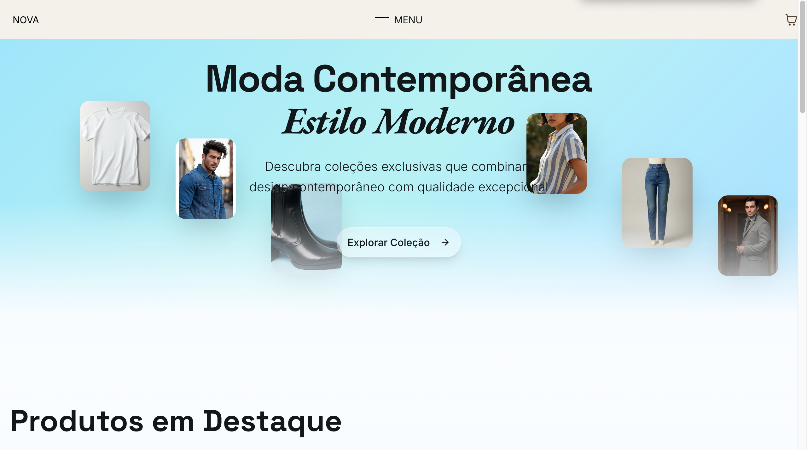

# NOVA E-commerce

Projeto de e-commerce moderno construído com Next.js (App Router), React e Tailwind CSS v4. Inclui listagem de produtos, página de detalhes, carrinho com persistência e uma navegação animada.

## Stack
- Next.js `16` (App Router)
- React `19`
- TypeScript `5`
- Tailwind CSS `4` + PostCSS (`@tailwindcss/postcss`)
- Radix UI Primitives + componentes utilitários (estilo shadcn)
- Framer Motion (animações de navegação)
- GSAP via CDN (efeitos na Home)
- Vercel Analytics
- SCSS Modules para partes específicas da UI

## Decisões Técnicas
- App Router com páginas em `app/` e uso de Client Components onde há interatividade (`"use client"`).
- Estado de carrinho com `React Context + useReducer` e persistência em `localStorage` (`lib/cart-context.tsx`).
- UI com Tailwind v4 usando `@import 'tailwindcss'` em `styles/globals.css` e tokens CSS (OKLCH) para tema claro/escuro.
- Componentes de UI baseados em Radix + utilitários locais (padrão shadcn, ver `components.json`).
- Imagens com `next/image` e `images.unoptimized: true` no `next.config.mjs` para simplificar build local.
- Fonts via `next/font/google` aplicadas no `app/layout.tsx`.
- Navegação animada usando Framer Motion e variantes definidas em `components/nav/header/anim.ts`.

## Como Rodar
- Pré-requisitos: Node.js `>= 18`
- Instalar dependências: `npm install`
- Ambiente de desenvolvimento: `npm run dev` e abrir `http://localhost:3000`
- Build de produção: `npm run build`
- Start de produção: `npm start`
- Opcional: o projeto possui `pnpm-lock.yaml`, mas os scripts usam `npm`. Se preferir `pnpm`, use `pnpm install` e `pnpm dev`.

## Scripts
- `npm run dev`: inicia o servidor de desenvolvimento
- `npm run build`: compila o projeto
- `npm start`: inicia o servidor após o build
- `npm run lint`: checa o código com ESLint

## Estrutura de Pastas
- `app/`: páginas e layout (App Router)
  - `page.tsx`: Home com efeitos GSAP
  - `products/`: listagem e rota dinâmica `[id]`
  - `cart/`: página de carrinho
- `components/`: componentes reutilizáveis (UI e navegação)
  - `nav/header`: cabeçalho com menu animado (Framer Motion + SCSS)
  - `ui/`: biblioteca de componentes (Radix/shadcn-style)
- `lib/`: utilitários e dados
  - `products-data.ts`: catálogo estático de produtos
  - `cart-context.tsx`: contexto e reducer do carrinho
- `hooks/`: hooks de UI (ex.: toasts)
- `styles/`: estilos globais Tailwind (`globals.css`)
- `public/`: assets e imagens

## Fluxos Principais
- Listagem e filtros/ordenação de produtos em `app/products/page.tsx`.
- Detalhe do produto com seleção de tamanho e adição ao carrinho em `app/products/[id]/page.tsx`.
- Carrinho com atualização/remoção e resumo em `app/cart/page.tsx`.

## Qualidade e Padrões
- TypeScript com `strict: true` em `tsconfig.json`.
- Alias de import configurados (`@/*`) para organização.
- ESLint disponível via `npm run lint`.
- Tailwind v4 com camadas e tokens de tema; variáveis de borda/raio configuradas em `styles/globals.css`.

## Deploy
- Compatível com Vercel (Next.js). Após `npm run build`, usar `next start` ou configurar deploy contínuo.
- `images.unoptimized` facilita deploy sem pipeline de otimização de imagens.

## Acessibilidade e SEO
- Metadados em `app/layout.tsx` (`Metadata`) para título/descrição.
- Componentes Radix ajudam em acessibilidade básica.

## Variáveis de Ambiente
- Não há `.env` obrigatório; o catálogo é estático e o carrinho usa `localStorage`.

## Melhorias Futuras
- Integração com backend/API para produtos e checkout real.
- Testes unitários e e2e.
- Otimização de imagens com `next/image` otimizado em produção.
- Internacionalização (i18n) e acessibilidade avançada.

## Preview

